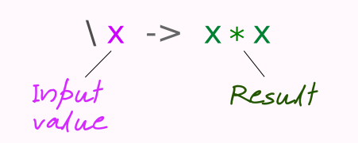

Today's superpower: Functional Wizard

### Values All The Way Down

> The following anecdote is told of William James. [...] After a lecture on cosmology and the structure of the solar system, James was accosted by a little old lady.
> 
> "Your theory that the sun is the centre of the solar system, and the earth is a ball which rotates around it has a very convincing ring to it, Mr. James, but it's wrong. I've got a better theory," said the little old lady.
> 
> "And what is that, madam?" inquired James politely.
> 
> "That we live on a crust of earth which is on the back of a giant turtle."
> 
> Not wishing to demolish this absurd little theory by bringing to bear the masses of scientific evidence he had at his command, James decided to gently dissuade his opponent by making her see some of the inadequacies of her position.
> 
> "If your theory is correct, madam," he asked, "what does this turtle stand on?"
> 
> "You're a very clever man, Mr. James, and that's a very good question," replied the little old lady, "but I have an answer to it. And it's this: The first turtle stands on the back of a second, far larger, turtle, who stands directly under him."
> 
> "But what does this second turtle stand on?" persisted James patiently.
> 
> To this, the little old lady crowed triumphantly,
> 
> "It's no use, Mr. James—it's turtles all the way down."
> 
> — J. R. Ross, Constraints on Variables in Syntax, 1967[10] (src: Wikipedia)

Everything's a value:

| | |
|-|-|
| `123` | is a value; it's an **integer** |
| `"hello"` | is a value; it's a **string** |
| `[ 1, 2, 3 ]` | is a value; it's a **list of integers** |
| `\x -> x * x` | is a value; it's a **function** (that squares a number) |

Functions don't just operate on values: they _are_ values. You can give them names, pass then to other functions, return them from functions and combine them in all sorts of interesting ways.

Simple independent functions are like Lego blocks: you can combine them to build anything. And, unlike Lego blocks, they take away the boring work by building themselves.

### Refresher on Haskell Function Definitions

Last week we saw something like this:

~~~ haskell
square n = n * n
~~~

Creates a function that squares its parameter, then associates it with the name `square`.

Two things to note:

1. I did _not_ say "creates a function named square." 
2. I said "associates it with" and not "assigns it to".

In fact, that syntax is really just _syntactic sugar_ for the following

~~~ haskell
square = \n -> n * n 
~~~

This makes it clearer. Just as `a = 123` associates the symbol `a` with the integer (whose value is 123),
`square = \n -> n*n` associates `square` with a function (that squares its parameter).

So, remember this: FUNCTIONS IN HASKELL ARE JUST VALUES.

## Lambda Functions

What's the reason for the strange notation `\x -> x*x`? Why the backslash and the arrow?

It all goes back to the 1930, and a mathematician called Alonso Church who tried to come up with a way of
describing things such as sets of numbers using just functions and variables. Part of his approach required
something that could be used to generate values: he created something called _lambda calculus_, so named
because he used the notation _λ n → n ∗ n_. The backslash in Haskell function definitions is
## Functions Take a Parameter and Return a Value

You're used to trig functions such as _sin x_ and _cos x_. You give them an angle and they return a ratio.
More generally, math functions take a value and return a result.

So do Haskell functions:

Here's a function that adds two to its parameter:

~~~ haskell
add2 = \n -> n + 2

add2 3
=> 5
~~~

And here's one that adds three:

~~~ haskell
add3 = \n -> n + 3
~~~

Say we wanted to save ourselves all that typing when we wanted to create `add`_x_ functions. Let's write a function to do the work for us:

~~~ haskell
addx = \x -> \n -> n + x
~~~

Then we could say

~~~ haskell
add5 = addx 5
add7 = addx 7

add5 6
=> 11

add7 8
=> 15
~~~

But just what is this doing? Let's look at the definition of `addx`, breaking it into parts:

~~~ haskell
addx = \x -> \n -> n + x
    
     = \                   -- a lambda function
        x                  -- that takes a parameter x
          ->               -- and returns...
             \             -- a lambda function (!)
              n            -- that takes a parameter n 
                ->         -- and returns...
                   n + x
~~~

You might find it easier to read the function definition if we add parentheses:

~~~ haskell
addx = \x -> (\n -> n + x)
~~~

So when we write 

~~~ haskell
add5 = addx 5
~~~

the `addx` function returns a new function `\n -> n + x`, but with `x` set to 5, so it becomes `\n -> n + 5`.

Having functions that return new functions is an exciting part of Haskell (and functional programming in
general), because it means that you can write code that itself writes code. It's like being able to extend the
language to suit the problem you're trying to solve.

### One More Wafer Thin Mint

Let's continue to play with `addx`. We know that `addx 4` creates a new function that adds 4 to its
parammeter. 

~~~ haskell
add4 = addx 4
add4 5
=> 9
~~~

What happens if we pass `addx` an additional parameter?

~~~ haskell
addx 6 7
=> 13 
~~~

Whoa! It went ahead and added the 6 to the 7. 

Think about why... 

To help, let's add some parentheses:

~~~ haskell
(addx 6) 7
=> 13 
~~~

The expression first evaluates `addx 6`. This returns a function that adds 6 to its parameter. At this
intermediate state, it's as if we now had

«func-to-add-6» 7

So, Haskell simply calls this generated function, passing it `7`.

This is profound: `addx 6 7` behaves exactly like a function with two parameters (in fact it behaves just like
add). But it's actually one function that when called generates another function, and that function is then
called with the second parameter. 

But if we call `addx` with only one parameter, it just returns that generated function, which we can call
later.

### Curried Functions

In fact, all the functions you write in Haskell are implemented internally as if they were one or more
single-parameter functions. 

It the function you write has one parameter, then the generated function is just that function:

| You write | Haskell sees... |
|-----------|-----------------|
| ` ` `myfun = \ a -> a*a`  _or_ `myfun a = a*a` | `myfun = \ a -> a*a` |
 
If you write a function with two parameters, then Haskell sees it as a function that takes the first parameter, and
that function returns another function that takes the second parameter.

| You write | Haskell sees... |
|-----------|-----------------|
| ` ` `myfun = \ a b -> a*b`  _or_ `myfun ab = a*b` | `myfun = \ a -> \b -> a*b` |
 

For three parameters, it's

| You write | Haskell sees... |
|-----------|-----------------|
| ` ` `myfun = \ a b c -> a*b + c`  _or_ `myfun a b c = a*b + c` | `myfun = \ a -> \b -> \c -> a*b + c` |
 

This process of replacing a function that takes _n_ parameters with _n_ functions that each take one parameter
is called _currying_.

(Fun fact: the idea that you can replace an _n_ parameter function with _n_ single parameter ones
was known in the 1930s, well before computers were around. One of the mathematicians working in this area was
called Haskell Curry, and the technique was later named _currying_ after him. Can you think of anything else that
might have been named in his honor?)

### So What?

Once you have the ability to curry functions, you automatically get a super power. It you call a function with all
the parameters it needs, it'll return the value you expect.

But if you call it with fewer parameters, it'll instead return a function. You can then call that function
with the remaining parameters and the value will pop out.

Here's an example:

~~~ haskell
times a b = a * b   -- \a -> (\b -> a * b)

times 2 3           -- (times 2) 6
=> 6                -- (\b -> 2 * b)

double = times 2    -- double = \b 2 * b
double 6
=> 12 
~~~

Or...

~~~ haskell
wrapIn delimiter string = delimiter ++ string ++ delimiter

wrapInQuotes = wrapIn "'"
wrapInColons = wrapIn ":"

wrapInQuotes "literally"
=> 'literally'
wrapInColons "literally"
=> :literally:
~~~

### One Last Example

The built-in function `map` takes a collection and a function. It
returns a new collection where each element is the result of applying
the function to the corresponding element in the original collection.

~~~ haskell
map (\x -> x*x) [1, 2, 3, 4]
=> [1, 4, 9, 16]
~~~

Because functions are values, we could also write:

~~~ haskell
square x = x*x
map square [1, 2, 3, 4]
=> [1, 4, 9, 16]
~~~

And because `map` is also just a function, we could write

~~~ haskell
squareList = map square
squareList [2, 4, 6]
=> [4, 16, 36]
~~~

In the last example, when we write `map square` we are calling `map`
with just one parameter, so the result is a function.

## Haskell Type Signatures

You may have noticed Visual Studio Code displaying a faint line of text
above expressions you enter. For example:

~~~ haskell
-- n :: Integer
   n = 123
~~~

If you define a function, the type signature is a little funky:

~~~ haskell
-- inc :: Num a => a -> a
   inc n = n + 1
~~~

Look at the end of the type signature first: `a -> a`. That's reminiscent
of a lambda function, and with good reason. `a -> a` is the type
signature of a function that takes a value of some arbitrary type `a`
and returns a value of that same type. 

But we know that addition only makes sense for numbers, so that's what
the preceding part says: `Num a =>` means "in what follows, the type
represented by `a` must have the capabilities of a number (type `Num`).

So, you can read the type specification `inc :: Num a => a -> a` as
"`inc` is a function that takes something thats a number and returns a
value of that same type."

### Types of Functions with Multiple Parameters

Again, is VSC:

~~~ haskell
-- add :: Num a => a -> a -> a
   add a b = a + b
~~~

Newcomers to Haskell are often confused by this. They expect to see
something like

~~~ haskell
-- add :: Num a => a a -> a
   add a b = a + b
~~~

But, now that you know about currying, you can work out why the
signature is the way it is: add is a function that takes a number and
returns a function that itself takes a number. This second function then
returns a number.

Homework:

Fork the repository https://github.com/Eastside-FP/daytwo, then clone
your version of it to your local machine. 

This README.md file summaries what we covered in class (it's probably
easiest to read the nicely formatted version on github).

Once you're comfortable with the material, edit the file assignment.hs
and define the five functions it asks for, checking each time that it
runs in ghci. Finally, play a little with ther `eulerSum` function I
supplied.

